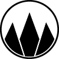
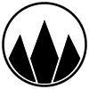
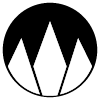
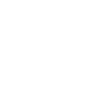

# Westwoodlabs Design, Font and Template Repository

## Names

- `Westwoodlabs e.V.`
  - Short: `WWL` or `WWLabs`
  - Claim: `Der Hackerspace im Westerwald`
  - Dont's: ~~`WESTWOODLABS`, `WestwoodLabs`, `Westwood Labs`, `W3stw00dl4b$`, etc.~~
- `Westwood Camp`
  - Short: `WAMP`
  - Claim: `Das Camp im Westerwald`
  - Dont's: ~~`wamp`, `Wamp`, `WestWood Camp`, `Westwoodlabs Camp`, `WESTWOOD CAMP`, `Westwood Labs Camp`, `Westw00dlabs Camp`, etc.~~

## Logos

All logos are available as:

- SVG (Scalable Vector Graphics)
- PNG with pre-defined sizes (100x100, 200x200, 500x500, 1000x1000, 2000x2000, 5000x5000)

The following overview shows the logos for light and dark backgrounds. The logos are available with and without a backgroundand are also available with a round background.

### WWL Logo Light - for Light Backgrounds

| (Default)                        | Normal Background                   | No Background                         | Round Background                         |
| -------------------------------- | ----------------------------------- | ------------------------------------- | ---------------------------------------- |
|  |  |  |  |

### WWL Logo Dark - for Dark Backgrounds

| (Default)                       | Normal Background                  | No Background                        | Round Background                        |
| ------------------------------- | ---------------------------------- | ------------------------------------ | --------------------------------------- |
|  |  |  |  |

### WAMP Logo Light - for Light Backgrounds

| (Default)                          | Normal Background                     | No Background                           | Round Background                           |
| ---------------------------------- | ------------------------------------- | --------------------------------------- | ------------------------------------------ |
|  |  |  |  |

### WAMP Logo Dark - for Dark Backgrounds

| (Default)                         | Normal Background                    | No Background                          | Round Background                          |
| --------------------------------- | ------------------------------------ | -------------------------------------- | ----------------------------------------- |
|  |  |  |  |

## Fonts

### Orbitron

We use the Google Font `Orbitron` for our name. It is available in the `fonts` folder or can be found on [Google Fonts](https://fonts.google.com/specimen/Orbitron).

The font is licensed under the [Open Font License](https://openfontlicense.org/), which means it is free to use, even for commercial purposes.

